# `</>` Basic Linux for Developers `</>`;

#### WORKSHOP # 01; 
#### Date: 2021-12-04;  
#### Time: 14:00 - 17:00;  
#### Location: Microsoft Teams;

---

## Why developer need to know Linux?

- In microservices architecture, more or less, we will need to hand-on Linux server 
- Almost every server are linux, event the container
- If you are a full-stack engineer, you may need to cover everything from infrastructure to system architecture, application architecture, then coding

## Objectives:

- Not to be a system administrator, but at least, this will support some part of your work
- Get ready for full-stack engineering
- Get ready to explore containerization
- Get ready to start exploring IaaC, SAaaC, and more...
- To share some basic command lines those are needed for daily development operation


## Prerequisite:

To be able to practise in this workshop session you need to have a linux machine ready ether localhost, on-premise, cloud.
I recommend getting EC2 instant ready in AWS.

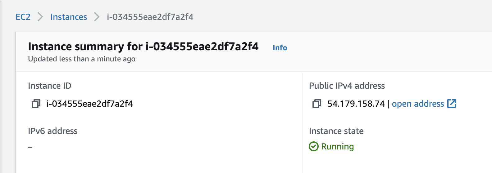

## Practice along:

- there will be a [branch](https://github.com/SarathLUN/basic-linux-for-developers/tree/LAB) `LAB` in which you will practice and submit back the result
- clone from branch `LAB` to your branch: `LAB-Sarath`, then start working on your branch
- after finish this session, you will need to push your branch back to this repo

## 1. user and login

- create user

```shell
useradd -m $username # Ex: useradd -m tony.stark, this will create user along with home directory
```

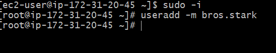

```shell
[ec2-user@ip-172-31-20-45 ~]$ sudo -i
[root@ip-172-31-20-45 ~]# useradd -m bros.stark
```

- set password

```shell
passwd $username # Ex: passwd tony.stark, then enter the password and confirm password
```
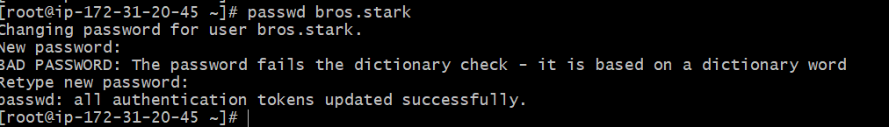

- add group member

```shell
usermod -G sudo $username # add user to group sudo
```

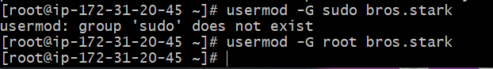

- login

```shell
ssh $username@$IP_address # not recommended to use IP, instead should use hostname
ssh $username@$hostname # default port ssh = 22
ssh -p $port_number $username@$hostname # custom port ssh
```

_your output here (image or console)_

- switch user

```shell
sudo -i # switch to user root
```

_your output here (image or console)_

## 2. exploration

- current directory

```shell
pwd # show the path of current working directory
```

In path, `.` is referred to current directory, while `..` is refer to parent directory (1 level up).

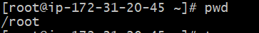

- change directory

Linux file system will start with root `/`, check more detail on directory structure [here](https://www.howtogeek.com/117435/htg-explains-the-linux-directory-structure-explained/)

```shell
cd /home/tony.stark # this will change directory to the home directory of user 'tony.stark'
cd . # change directory to current directory, mean no going anywhere
cd .. # change directory to parent directory in 1 level up
cd ../.. # change directory to parent directory in 2 levels up
```

_your output here (image or console)_

- hidden

In linux, hidden file will be indicated by `.` prefix of the name of file or directory `.file_name`, `.directory_name`

```shell
drwxr-xr-x   13 sarath  staff   416B Nov 23 16:55 .git # this is a hidden directory
-rw-r--r--    1 sarath  staff   620B Nov  6 22:11 .gitignore # this is a hidden file
```

_your output here (image or console)_

- list

```shell
ls # list out in column base layout of files & sub-directories in current directory 
ls -l # list out in detail base layout of files & sub-directories in current directory
ls -la # list out in detail base layout of files & sub-directories (including hidden) in current directory
```

_your output here (image or console)_

- tree view

```shell
tree . # tree view of current directory
```

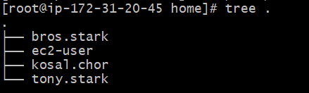
Some linux may not install `tree` by default, however we still can install via its package manager

```shell
yum install tree # for RedHat family
apt install tree # for Debian family
```

also check more detail about default package manager [here](https://www.makeuseof.com/tag/power-choice-power-package-management/).

## 3. operation on file and folder

- create file

```shell
touch $file_name
```

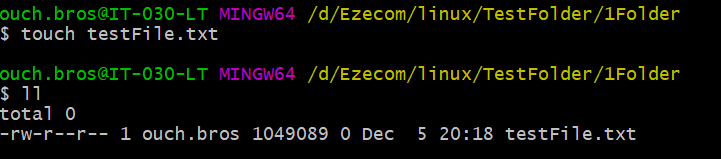

- update file

```shell
vim $file_name
```


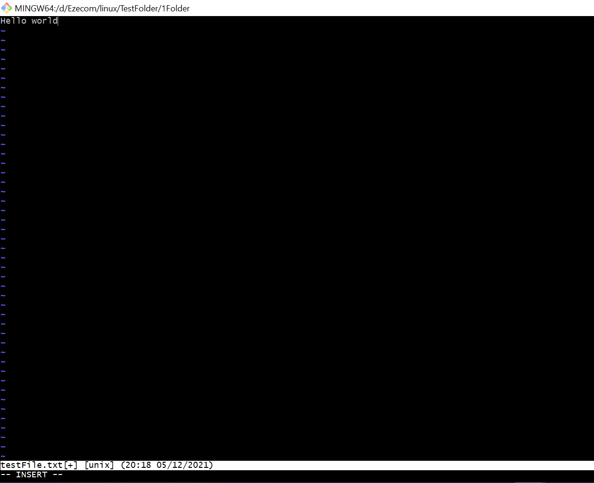

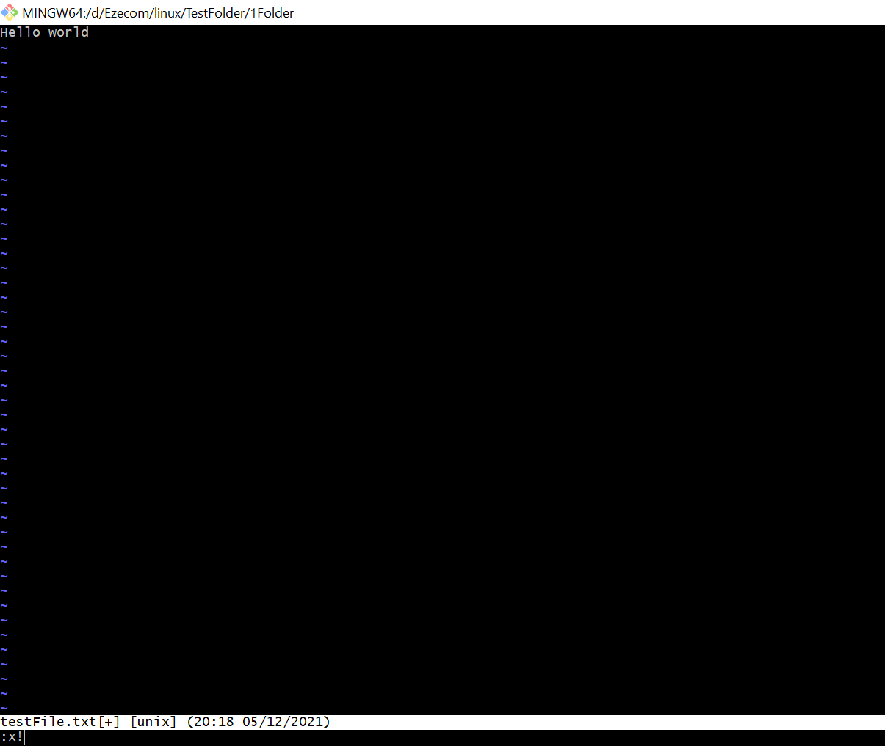

- remove file

```shell
rm $file_name
```

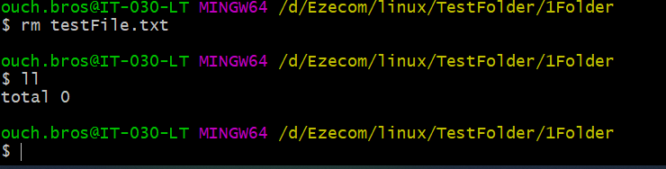

- read file

```shell
cat $file_name
less $file_name
tail $file_name
grep 'search key word' $file_name
```

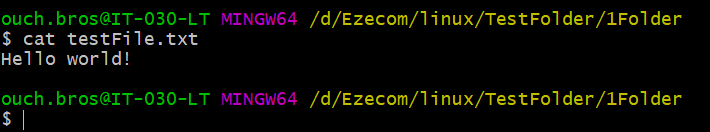

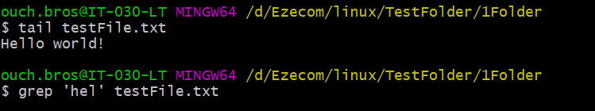
- create directory

```shell
mkdir $directory_name
```

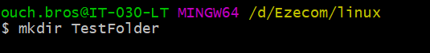

- remove directory

```shell
rm $directory_name
```

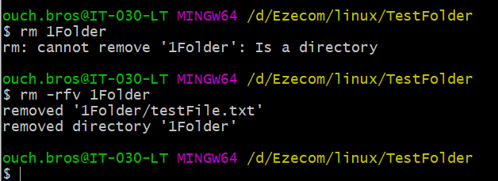

- copy

```shell
cp $source_path $destination_path
```

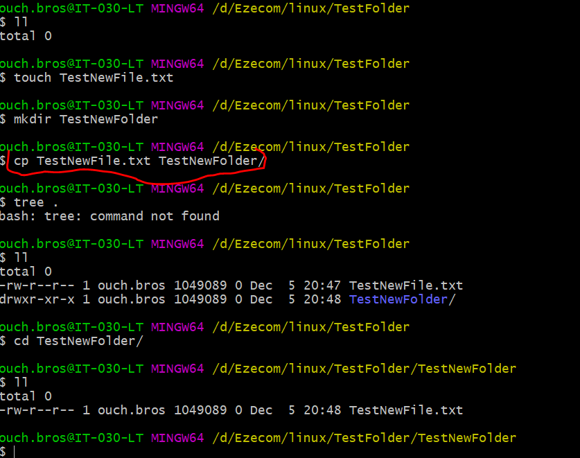

- move

```shell
mv $source_path $destination_path
```

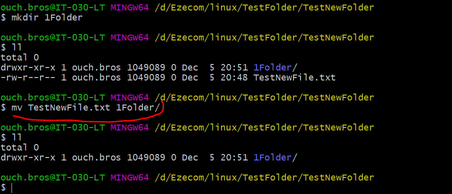

## 4. permission

4 blocks:
1. identify directory or file
2. permission of user owner
3. permission of group owner
4. permission of other user

```shell
-rw-r--r--    1 sarath  staff   1.1K Nov 22 11:18 package.json
drwxr-xr-x   11 sarath  staff   352B Nov 23 09:30 src
```

**The above `package.json`:**

- it is a file, not a directory
- user owner = `sarath` with permission `read` + `write`.
- group owner = `staff` with permission `read` only, thus all users in this group will be able to `read` this file.
- other user who not in the group `staff` will have permission `read` only.

**The above `src`:**

- it is a directory, not a file
- user owner = `sarath` with permission `read` + `write` + `execute` (`execute` on a directory = open)
- group owner = `staff` with permission `read` + `execute`
- other user got permission `read` + `execute`

more detail check [here](https://www.linux.com/training-tutorials/understanding-linux-file-permissions/).

_your output here (image or console)_

## 5. service and process

- show status service

```shell
systemctl status $service_name # systemctl status nginx
```

_your output here (image or console)_

- start service

```shell
systemctl start $service_name # systemctl start nginx
```

_your output here (image or console)_

- stop service

```shell
systemctl stop $service_name # systemctl stop nginx
```

_your output here (image or console)_

- restart service

```shell
systemctl restart $service_name # systemctl restart nginx
```

_your output here (image or console)_

- some services may have reload such as `nginx`

```shell
systemctl reload $service_name # systemctl reload nginx
```

_your output here (image or console)_

- show current running processes

```shell
ps
ps -aux
top
```

_your output here (image or console)_

## 6. connection check

- check IP if reachable

```shell
ping $IP_address
ping $host_name
```

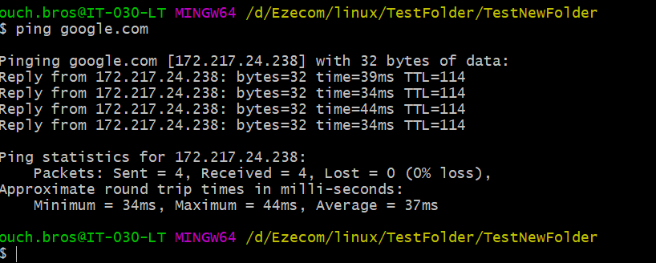

- check port if connectable

```shell
telnet $IP_address $port_number
telnet $host_name $port_number
```

_your output here (image or console)_

- test if able to get response page

```shell
curl $end_point
```

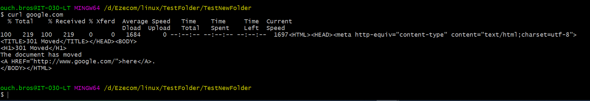

- get IP address of a host name

```shell
nslookup $host_name
nslookup $IP_address
```


## Bonus

- [Linux Command-Line Tips & Tricks: Over 15 Examples!](https://www.youtube.com/watch?v=NsK7OPlK94U)